# 📚 CRM RENTACAMERA - COMPLETE PROJECT DOCUMENTATION

> **Version**: 1.0.0  
> **Last Updated**: 2025-12-16  
> **Status**: Domain Layer Complete, Client UI Development Phase

---

## 📑 TABLE OF CONTENTS

- [Project Overview](#PROJECT-OVERVIEW)
- [Architecture](#ARCHITECTURE)
- [Domain Layer](#DOMAIN-LAYER)
- [Application Layer](#APPLICATION-LAYER)
- [Infrastructure Layer](#INFRASTRUCTURE-LAYER)
- [Data Flow and Interactions](#DATA-FLOW-AMD-INTERACTIONS)
- [Technology Stack](#TECH-STACK)
- [Current Implementation Status](#IMPLEMENTATION-STATUS)

---

## PROJECT OVERVIEW

### Business Domain
**CRM система для аренды фото/видео оборудования** с межгородской логистикой и партнёрской сетью.

### Key Features
- 🎥 **Equipment Rental**: Каталог оборудования с детальными спецификациями
- 📅 **Booking System**: Система бронирования с проверкой доступности
- 🚚 **Logistics**: Межгородские переброски оборудования (ЕКБ ↔ УФА ↔ СМР ↔ ТМН)
- 💰 **Pricing Engine**: Гибкая система ценообразования (почасово, дневная, недельная)
- 🔔 **Notifications**: Мультиканальные уведомления (Email, SMS, Telegram, Push)
- 👥 **Multi-tenant**: Клиенты, Сотрудники, Партнёры
- 📊 **Analytics**: Отчётность и аналитика

### Business Rules
```
1. Минимальный срок аренды: 3 часа
2. Депозит: 30% от стоимости аренды
3. Штрафы за отмену:
   - >48 часов до начала: 0%
   - 24-48 часов: 50% депозита
   - <24 часов: 100% депозита
4. Штрафы за просрочку возврата:
   - До 2 часов: 10% от стоимости
   - До 24 часов: 25% от стоимости
   - >24 часов: полная стоимость + депозит
```

---

## ARCHITECTURE

### High-Level Architecture

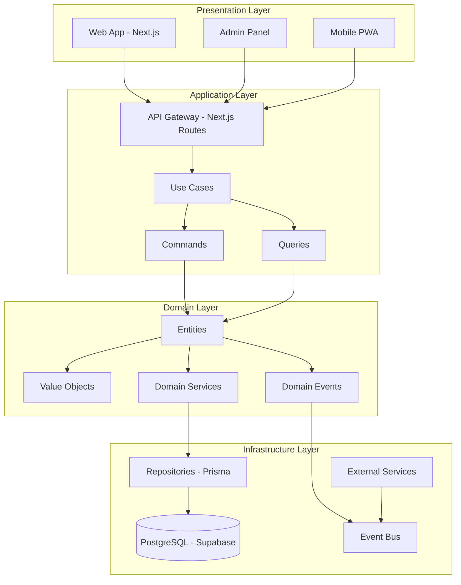

### Clean Architecture Layers

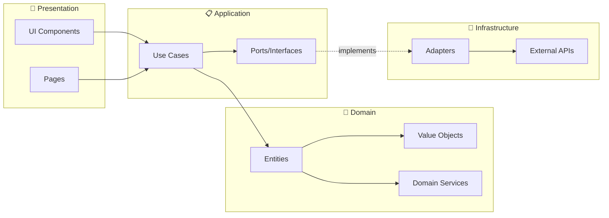

### Dependency Rule
```
🎨 Presentation → 📋 Application → 💼 Domain ← 🔧 Infrastructure
                                      ↑
                               (зависимости только внутрь)
```

---

## DOMAIN LAYER

### Bounded Contexts

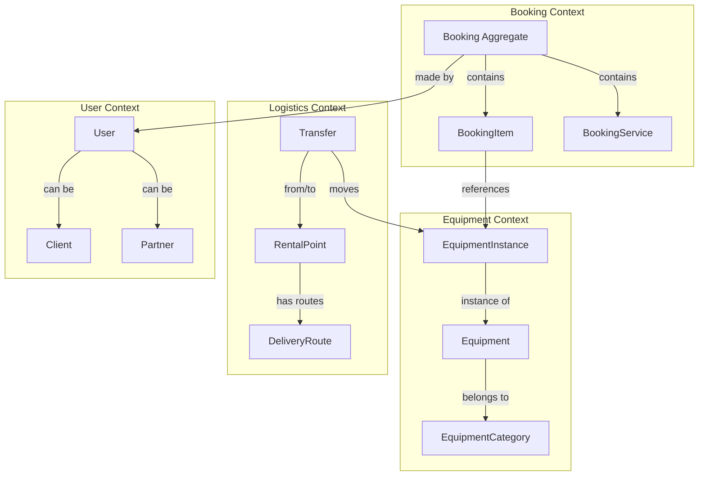

### 1. Booking Context (Bounded Context)

#### Entities

**Booking** (Aggregate Root)
```typescript
class Booking {
  // Identity
  private readonly id: string
  private readonly number: string  // "BK-2025-001"
  
  // Core Data
  private readonly userId: string
  private readonly pickupLocationId: string
  private readonly period: RentalPeriod
  private readonly equipmentIds: string[]
  
  // Pricing
  private readonly totalAmount: Money
  private readonly depositAmount: Money
  private penaltyAmount?: Money
  
  // State
  private status: BookingStatus  // PENDING → CONFIRMED → ACTIVE → COMPLETED
  
  // Domain Events
  private domainEvents: DomainEvent[]
  
  // Business Methods
  confirm(): void
  cancel(reason: string, penalty?: Money): void
  activate(): void
  complete(): void
  calculatePenalty(date: Date): Money
  
  // Validation
  isValidForConfirmation(): boolean
  canBeModified(): boolean
}
```

**BookingItem** (Entity)
```typescript
class BookingItem {
  id: string
  bookingId: string
  equipmentInstanceId: string
  quantity: number
  unitPrice: Float
  discount: Float
  totalPrice: Float
  requiresTransfer: boolean
  sourceLocationId?: string
}
```

#### Value Objects

**RentalPeriod**
```typescript
class RentalPeriod {
  constructor(
    public readonly startDate: Date,
    public readonly endDate: Date
  )
  
  getDurationInHours(): number
  getDurationInDays(): number
  contains(date: Date): boolean
  overlaps(other: RentalPeriod): boolean
}
```

**Money**
```typescript
class Money {
  constructor(
    public readonly amount: number,
    public readonly currency: string = 'RUB'
  )
  
  add(other: Money): Money
  subtract(other: Money): Money
  multiply(factor: number): Money
}
```

#### Domain Events

```typescript
// Events triggered by Booking Aggregate
class BookingCreatedEvent {
  bookingId: string
  userId: string
  equipmentIds: string[]
  period: { startDate: Date; endDate: Date }
  totalAmount: number
  createdAt: Date
}

class BookingConfirmedEvent {
  bookingId: string
  userId: string
  confirmedAt: Date
}

class BookingCancelledEvent {
  bookingId: string
  userId: string
  reason: string
  penaltyAmount: number | null
  cancelledAt: Date
}

class BookingActivatedEvent {
  bookingId: string
  activatedAt: Date
}

class BookingCompletedEvent {
  bookingId: string
  userId: string
  actualReturnDate: Date
  completedAt: Date
}
```

#### Domain Services

**PenaltyService**
```typescript
class PenaltyService {
  calculateCancellationPenalty(
    booking: Booking,
    cancellationDate: Date
  ): PenaltyCalculationResult
  
  calculateLateReturnPenalty(
    booking: Booking,
    actualReturnDate: Date
  ): PenaltyCalculationResult
  
  calculateNoShowPenalty(
    booking: Booking
  ): PenaltyCalculationResult
}
```

**PricingService**
```typescript
class PricingService {
  calculateTotal(params: {
    equipmentItems: EquipmentItem[]
    period: RentalPeriod
    discountRate: number
  }): Promise<Money>
  
  calculateDeposit(totalAmount: Money): Money
}
```

#### Specifications (Business Rules)

```typescript
class BookingCanBeCreatedSpecification {
  isSatisfiedBy(booking: Booking, equipment: Equipment[]): boolean {
    return (
      equipment.every(eq => eq.isAvailableForRent()) &&
      booking.period.getDurationInHours() >= 3 &&
      booking.totalAmount.amount > 0
    )
  }
}

class BookingCanBeCancelledSpecification {
  isSatisfiedBy(booking: Booking, date: Date): boolean {
    const hours = (booking.startDate.getTime() - date.getTime()) / 3600000
    return (
      (booking.status === 'PENDING' || booking.status === 'CONFIRMED') &&
      hours > 0
    )
  }
}
```

---

### 2. Equipment Context

#### Entities

**Equipment** (Aggregate Root)
```typescript
class Equipment {
  // Identity
  id: string
  sku: string              // "CAM-SONY-A7IV-001"
  serialNumber: string
  
  // Classification
  categoryId: string
  brand: string
  model: string
  
  // Specifications
  specifications: EquipmentSpecifications
  
  // Pricing
  baseHourlyRate: Money
  baseDailyRate: Money
  baseMonthlyRate: Money
  depositAmount: Money
  replacementCost: Money
  pricingMatrix: Json       // Complex pricing rules
  
  // Metadata
  tags: string[]
  images: string[]
  manuals: string[]
  status: EquipmentStatus   // ACTIVE | INACTIVE | DISCONTINUED
  isPublic: boolean
  
  // Partner
  partnerId?: string
  
  // Relations
  instances: EquipmentInstance[]
  
  // Business Methods
  updatePricing(...)
  updateStatus(...)
  isAvailableForRent(): boolean
}
```

**EquipmentInstance** (Entity)
```typescript
class EquipmentInstance {
  id: string
  serialNumber: string
  internalId: string           // "CAM-001-EKB-P1"
  equipmentId: string
  currentLocationId: string
  status: InstanceStatus       // AVAILABLE | RENTED | MAINTENANCE | RESERVED
  condition: Condition         // EXCELLENT | GOOD | FAIR | POOR | DAMAGED
  
  // Inventory
  inventoryNumber?: string
  barcode?: string
  
  // Maintenance
  purchaseDate?: Date
  lastMaintenanceDate?: Date
  nextMaintenanceDate: Date
  
  // Business Methods
  reserve(): void
  release(): void
  markAsRented(): void
  markAsMaintenance(): void
  updateCondition(condition, notes?): void
  isAvailable(): boolean
  needsMaintenance(): boolean
}
```

---

### 3. Logistics Context

#### Entities

**EquipmentTransfer** (Aggregate Root)
```typescript
class EquipmentTransfer {
  id: string
  equipmentInstanceId: string
  fromLocationId: string
  toLocationId: string
  
  // Schedule
  scheduledDeparture: Date
  estimatedArrival: Date
  actualDeparture?: Date
  actualArrival?: Date
  
  // Status
  status: TransferStatus    // PENDING | SCHEDULED | IN_TRANSIT | DELIVERED
  transferType: TransferType // BOOKING_RELATED | STOCK_BALANCE | MAINTENANCE
  
  // Context
  associatedBookingId?: string
  notes?: string
  
  // Business Methods
  markAsInTransit(): void
  markAsDelivered(): void
  cancel(): void
}
```

**RentalPoint** (Entity)
```typescript
class RentalPoint {
  id: string
  name: string
  code: string              // "EKB", "UFA", "SMR", "TMN"
  address: string
  isActive: boolean
  
  // Relations
  equipmentInstances: EquipmentInstance[]
  outgoingTransfers: EquipmentTransfer[]
  incomingTransfers: EquipmentTransfer[]
  
  // Business Methods
  activate(): void
  deactivate(): void
  updateAddress(address: string): void
}
```

#### Domain Services

**LogisticsService**
```typescript
class LogisticsService {
  // Predefined routes between cities
  private transferRoutes: Map<string, TransferRoute>
  
  calculateTransferTimeLine(
    from: RentalPoint,
    to: RentalPoint,
    bookingStart: Date,
    bookingEnd: Date
  ): TransferTimeLine | null
  
  getRoute(fromId: string, toId: string): TransferRoute
  updateRoute(fromId, toId, transitDays): void
}
```

**AvailabilityService**
```typescript
class AvailabilityService {
  checkEquipmentAvailability(
    request: AvailabilityRequest
  ): Promise<AvailabilityCheckResult>
  
  checkBulkAvailability(
    requests: AvailabilityRequest[]
  ): Promise<Map<string, AvailabilityCheckResult>>
  
  checkInterCityAvailability(
    equipmentId: string,
    from: RentalPoint,
    to: RentalPoint,
    period: RentalPeriod
  ): Promise<AvailabilityCheckResult>
}
```

---

### 4. User Context

#### Entities

**User** (Aggregate Root)
```typescript
class User {
  id: string
  email: string
  phone: string
  firstName: string
  lastName: string
  role: UserRole            // ADMIN | MANAGER | CLIENT | PARTNER
  
  // Profile
  avatar?: string
  discountRate?: number
  
  // Status
  isActive: boolean
  isVerified: boolean
  lastLoginAt?: Date
  
  // Relations (polymorphic)
  client?: Client
  employee?: Employee
  partner?: Partner
  
  // Business Methods
  updateProfile(...)
  hasDiscount(): boolean
  canMakeBooking(): boolean
  getFullName(): string
}
```

**Client** (Entity)
```typescript
class Client {
  id: string
  userId: string
  clientType: ClientType    // INDIVIDUAL | LEGAL | PARTNER
  
  // Documents
  documentType?: string
  documentNumber?: string
  dateOfBirth?: Date
  
  // Legal Entity
  companyName?: string
  taxId?: string
  
  // Emergency Contact
  emergencyContactName?: string
  emergencyContactPhone?: string
  
  // Loyalty
  totalBookings: number
  totalSpent: number
  loyaltyLevel: LoyaltyLevel // STANDARD | SILVER | GOLD | PLATINUM
  creditLimit: number
}
```

**Partner** (Entity)
```typescript
class Partner {
  id: string
  userId: string
  partnerType: PartnerType  // INDIVIDUAL | LEGAL
  
  // Company
  companyName?: string
  taxId?: string
  bankAccount?: string
  
  // Contract
  commissionRate?: number
  paymentMethod?: PaymentMethod
  contractNumber?: string
  contractTerms?: Json
  
  // Status
  isActive: boolean
  
  // Relations
  equipment: Equipment[]
}
```

---

## APPLICATION LAYER

### CQRS Pattern Implementation

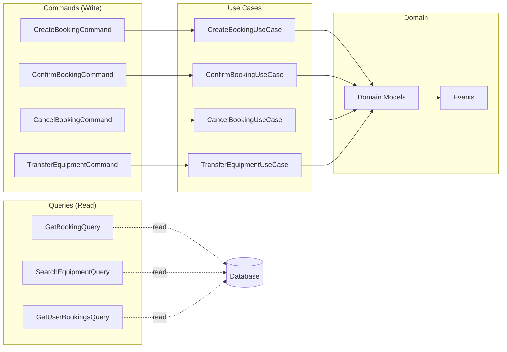

### Use Cases Implementation

#### 1. CreateBookingUseCase

**Flow Diagram**
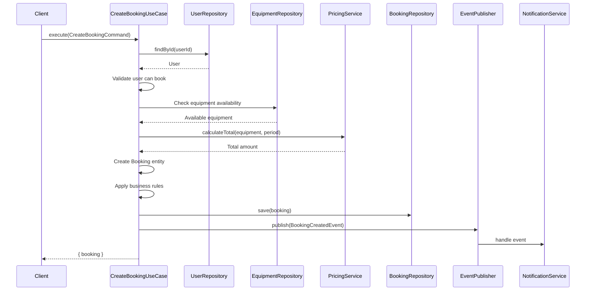

**Code Implementation**
```typescript
export class CreateBookingUseCase {
  constructor(
    private readonly bookingRepository: IBookingRepository,
    private readonly userRepository: IUserRepository,
    private readonly equipmentRepository: IEquipmentRepository,
    private readonly pricingService: PricingService,
    private readonly notificationService: INotificationService,
    private readonly eventPublisher: IEventPublisher,
  ) {}

  async execute(command: CreateBookingCommand): Promise<{ booking: Booking }> {
    // 1. Validate User
    const user = await this.userRepository.findById(command.userId)
    if (!user) throw new Error('User not found')
    
    const userCanBook = new UserCanMakeBookingSpecification().isSatisfiedBy(user)
    if (!userCanBook) throw new Error('User cannot make booking')
    
    // 2. Check Equipment Availability
    const period = new RentalPeriod(command.startDate, command.endDate)
    const equipmentItems = []
    
    for (const item of command.equipmentItems) {
      const available = await new EquipmentIsAvailableSpecification(
        this.equipmentRepository
      ).isSatisfiedBy(item.equipmentInstanceId, period)
      
      if (!available) {
        throw new Error(`Equipment ${item.equipmentInstanceId} not available`)
      }
      
      const equipment = await this.equipmentRepository.findById(
        item.equipmentInstanceId
      )
      if (equipment) equipmentItems.push(equipment)
    }
    
    // 3. Calculate Pricing
    const totalAmount = await this.pricingService.calculateTotal({
      equipmentItems: command.equipmentItems,
      period,
      discountRate: user.discountRate || 0,
    })
    
    const depositAmount = new Money(totalAmount.amount * 0.3)
    
    // 4. Create Booking
    const booking = Booking.create({
      userId: command.userId,
      pickupLocationId: command.pickupLocationId,
      period,
      totalAmount,
      depositAmount,
      equipmentIds: command.equipmentItems.map(i => i.equipmentInstanceId),
    })
    
    // 5. Business Rules Validation
    const canBeCreated = new BookingCanBeCreatedSpecification().isSatisfiedBy(
      booking,
      equipmentItems
    )
    if (!canBeCreated) {
      throw new Error('Booking cannot be created due to business rules')
    }
    
    // 6. Persist
    await this.bookingRepository.save(booking)
    
    // 7. Publish Events
    const events = booking.getDomainEvents()
    for (const event of events) {
      await this.eventPublisher.publish(event.payload)
    }
    booking.clearDomainEvents()
    
    // 8. Send Notification
    await this.notificationService.sendBookingConfirmation(user, booking)
    
    return { booking }
  }
}
```

#### 2. TransferEquipmentUseCase

**Flow Diagram**
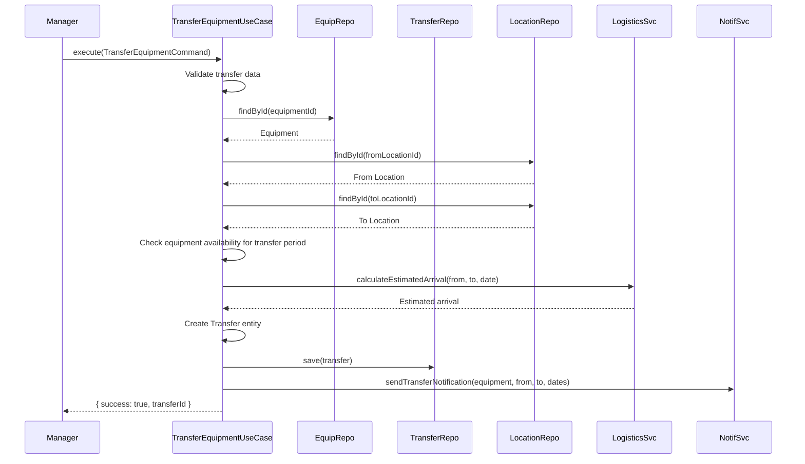

---

### Event Handlers

**BookingEventHandler**
```typescript
export class BookingEventHandler {
  constructor(
    private readonly notificationService: INotificationService,
    private readonly userRepository: IUserRepository,
    private readonly bookingRepository: IBookingRepository,
  ) {}

  async handleBookingCreated(event: BookingCreatedEvent): Promise<void> {
    const user = await this.userRepository.findById(event.userId)
    const booking = await this.bookingRepository.findById(event.bookingId)
    
    if (user && booking) {
      // Send confirmation to client
      await this.notificationService.sendBookingConfirmation(user, booking)
      
      // Notify managers
      await this.notificationService.sendBookingConfirmed(booking)
    }
  }

  async handleBookingCancelled(event: BookingCancelledEvent): Promise<void> {
    const user = await this.userRepository.findById(event.userId)
    const booking = await this.bookingRepository.findById(event.bookingId)
    
    if (user && booking) {
      await this.notificationService.sendCancellationNotification(
        booking,
        {
          penaltyAmount: event.penaltyAmount 
            ? { amount: event.penaltyAmount, currency: 'RUB' }
            : { amount: 0, currency: 'RUB' },
          penaltyReason: `Cancellation: ${event.reason}`,
          isPenaltyApplied: !!event.penaltyAmount,
        },
        user
      )
    }
  }
}
```

---

## INFRASTRUCTURE LAYER

### Repository Pattern Implementation

**PrismaBookingRepository**
```typescript
export class PrismaBookingRepository implements IBookingRepository {
  constructor(private prisma: PrismaClient) {}

  async findById(id: string): Promise<Booking | null> {
    const prismaData = await this.prisma.booking.findUnique({
      where: { id },
      include: { items: true, payments: true, services: true },
    })
    
    if (!prismaData) return null
    
    return this.toDomainEntity(prismaData)
  }

  async save(booking: Booking): Promise<void> {
    const data = {
      id: booking.id,
      number: booking.number,
      userId: booking.userId,
      pickupLocationId: booking.pickupLocationId,
      startDate: booking.startDate,
      endDate: booking.endDate,
      status: booking.status,
      totalAmount: booking.totalAmount.amount,
      depositAmount: booking.depositAmount.amount,
      penaltyAmount: booking.penaltyAmount.amount,
      totalHours: booking.period.getDurationInHours(),
      pricingType: 'DAILY' as const,
      discountRate: 0,
      calculatedPrice: {},
      updatedAt: new Date(),
    }

    await this.prisma.booking.upsert({
      where: { id: booking.id },
      create: { ...data, createdAt: new Date() },
      update: data,
    })
  }

  private toDomainEntity(prismaData: PrismaBookingType): Booking {
    const period = new RentalPeriod(prismaData.startDate, prismaData.endDate)
    const totalAmount = new Money(prismaData.totalAmount)
    const depositAmount = new Money(prismaData.depositAmount)
    const penaltyAmount = new Money(prismaData.penaltyAmount || 0)

    return Booking.reconstitute({
      id: prismaData.id,
      number: prismaData.number,
      userId: prismaData.userId,
      pickupLocationId: prismaData.pickupLocationId,
      period,
      totalAmount,
      depositAmount,
      status: StatusMapper.toDomain(prismaData.status),
      penaltyAmount,
      equipmentIds: [],
    })
  }
}
```

### Notification System Architecture

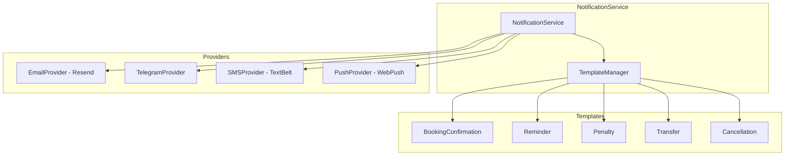

**Implementation**
```typescript
export class NotificationService implements INotificationService {
  private providers: Map<string, NotificationProvider>
  private templates: Map<string, NotificationTemplate>

  constructor(config: NotificationConfig) {
    this.initializeProviders()
    this.initializeTemplates()
  }

  async sendBookingConfirmation(user: User, booking: Booking): Promise<void> {
    const template = this.templates.get('BOOKING_CONFIRMATION')
    const recipient = RecipientFactory.createUserRecipient(user)
    
    const message = this.buildMessageFromTemplate(template, {
      bookingNumber: booking.number,
      totalAmount: `${booking.totalAmount.amount}`,
      startDate: booking.startDate.toLocaleDateString('ru-RU'),
      endDate: booking.endDate.toLocaleDateString('ru-RU'),
      location: booking.pickupLocationId,
    }, recipient)
    
    await this.sendToChannels(message, template.channels)
  }

  private async sendToChannels(
    message: NotificationMessage,
    channels: MassagerType[]
  ): Promise<void> {
    const promises = channels.map(async (channel) => {
      const provider = this.providers.get(channel)
      if (!provider?.isAvailable()) return
      
      return this.sendNotification({ ...message, type: channel })
    })
    
    await Promise.all(promises)
  }
}
```

---

## DATA FLOW AMD INTERACTIONS

### Complete Booking Flow

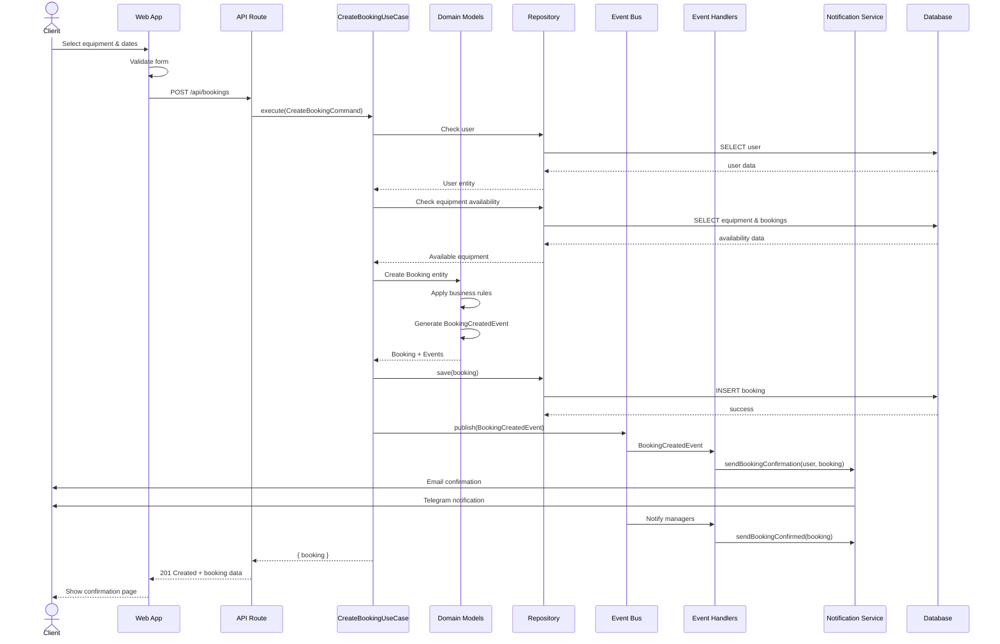

### Equipment Availability Check Flow

```mermaid
sequenceDiagram
    participant UI as Web App
    participant API as API Route
    participant AvailSvc as AvailabilityService
    participant EquipRepo as EquipmentRepository
    participant TransferRepo as TransferRepository
    participant LogisticsSvc as LogisticsService

    UI->>API: POST /api/availability/check
    Note over UI,API: { equipmentId, locationId, startDate, endDate }
    
    API->>AvailSvc: checkEquipmentAvailability(request)
    
    AvailSvc->>EquipRepo: isAvailable(equipmentId, dates)
    EquipRepo-->>AvailSvc: boolean
    
    alt Locally Available
        AvailSvc-->>API: { isAvailable: true, requiresTransfer: false }
    else Not Locally Available
        AvailSvc->>TransferRepo: findConflictingTransfers(equipmentId, dates)
        TransferRepo-->>AvailSvc: conflicting transfers
        
        AvailSvc->>LogisticsSvc: calculateTransferTimeLine(from, to, dates)
        LogisticsSvc-->>AvailSvc: transfer timeline
        
        AvailSvc-->>API: { 
            isAvailable: true/false,
            requiresTransfer: true,
            transferTimeline: {...}
        }
    end
    
    API-->>UI: Availability result
```

### Inter-City Transfer Flow

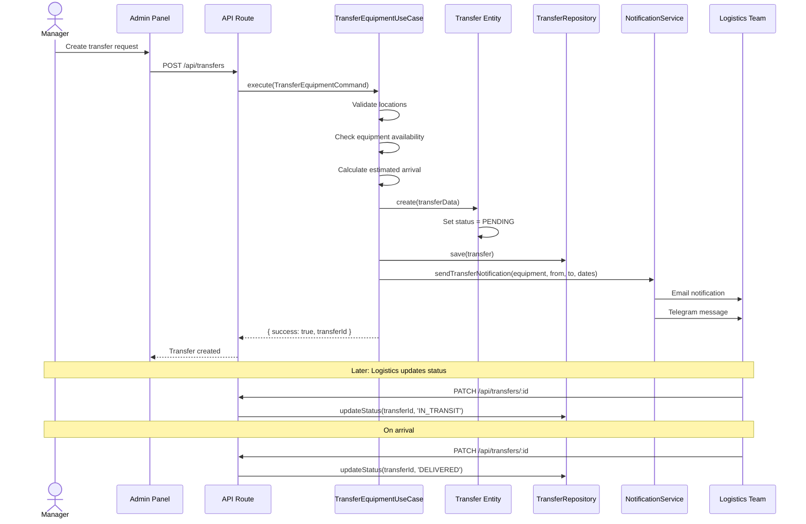

---

## TECH STACK

### Frontend Stack
```yaml
Framework: Next.js 15.5.9 (App Router)
React: 18.0.0
Language: TypeScript 5.3.3
Styling: 
  - Tailwind CSS 3.4.0
  - Ant Design 5.12.0
State Management:
  - TanStack Query 5.8.4 (Server State)
  - Zustand (Client State)
Forms: React Hook Form
Animations: Framer Motion 10.16.16
PWA: next-pwa 5.6.0
Testing:
  - Jest (Unit/Integration)
  - Playwright (E2E)
  - Testing Library (Components)
```

### Backend Stack
```yaml
Runtime: Node.js 20+
Framework: Next.js API Routes
Microservices: Fastify (planned)
Database: PostgreSQL (Supabase)
ORM: Prisma 6.17.1
Validation: Zod 3.22.4
Authentication: 
  - NextAuth.js 4.24.5 
  - JWT
Real-time: Socket.io-client 4.7.4
WebRTC: (for video consultations)
```

### Infrastructure
```yaml
Monorepo: Turborepo
Package Manager: pnpm 10.19.0
CI/CD: GitHub Actions
Hosting: Vercel (planned)
Database: Supabase (PostgreSQL + Auth + Storage)
Cache: TanStack Query + SWR
CDN: Vercel Edge Network
Monitoring: (to be added)
```

### Development Tools
```yaml
Linting: ESLint 9.37.0 + Biom
Formatting: Prettier 3.1.1 or Biom
Git Hooks: Husky 9.1.7 + lint-staged
Commit Convention: Commitlint (Conventional Commits)
Type Checking: TypeScript strict mode
```

### GraphQL
```yaml
Server:
  Framework: GraphQL Yoga 5.x (best fot Next.js)
  Schema: Schema-first (Code Generation)
  Validation: Zod + GraphQL Scalars
  DataLoader: (N+1 problem)
  
Client:
  Library: urql 4.x (minimum boilerplate)
  Cache: Normalized cache (document cache)
  DevTools: GraphiQL
  
Code Generation:
  Tool: GraphQL Code Generator
  Output: 
    - TypeScript types
    - React hooks
    - Operations types
```

### Authentication (JWT + NextAuth)
```yaml
NextAuth Configuration:
  Providers:
    - Credentials (Email/Password + JWT)
    - Google OAuth (option)
    - Telegram (for partners)
  
  JWT Strategy:
    Access Token: 
      - Lifetime: 15 minutes
      - Storage: Memory (not localStorage!)
      - Format: Signed JWT
    
    Refresh Token:
      - Lifetime: 7 days
      - Storage: HttpOnly Cookie (secure, sameSite)
      - Rotation: At every refresh
    
  Session:
    - Strategy: JWT (stateless)
    - Cookie: HttpOnly, Secure, SameSite=Lax
    - Encryption: JWE (Json Web Encryption)

Security:
  - CSRF protection (NextAuth built-in)
  - Rate limiting (via IP)
  - Token rotation
  - Refresh token reuse detection
  - XSS protection (no localStorage for tokens)
```

---

## IMPLEMENTATION STATUS

### ✅ Completed

```
Domain Layer (100%)
├── ✅ Entities
│   ├── ✅ Booking (Aggregate Root)
│   ├── ✅ Equipment (Aggregate Root)
│   ├── ✅ EquipmentInstance
│   ├── ✅ RentalPoint
│   ├── ✅ Transfer (Aggregate Root)
│   └── ✅ User (Aggregate Root)
│
├── ✅ Value Objects
│   ├── ✅ Money
│   ├── ✅ RentalPeriod
│   └── ✅ NotificationRecipient
│
├── ✅ Domain Services
│   ├── ✅ PricingService
│   ├── ✅ PenaltyService
│   ├── ✅ AvailabilityService
│   └── ✅ LogisticsService
│
├── ✅ Domain Events
│   ├── ✅ BookingCreated
│   ├── ✅ BookingConfirmed
│   ├── ✅ BookingCancelled
│   ├── ✅ BookingActivated
│   └── ✅ BookingCompleted
│
├── ✅ Domain Exceptions
│   ├── ✅ BookingException
│   └── ✅ DomainException
│
└── ✅ Specifications
    ├── ✅ BookingSpecifications
    ├── ✅ EquipmentSpecifications
    └── ✅ UserSpecifications

Application Layer (90%)
├── ✅ Use Cases
│   └── Booking
│       ├── ✅ CreateBookingUseCase
│       ├── ✅ ConfirmBookingUseCase
│       ├── ✅ CancelBookingUseCase
│       └── ✅ TransferEquipmentUseCase
│
├── ✅ Commands
│   └── Booking
│       ├── ✅ CreateBookingCommand
│       ├── ✅ ConfirmBookingCommand
│       ├── ✅ CancelBookingCommand
│       └── ✅ TransferEquipmentCommand
│
├── ✅ Event Handlers
│   └── ✅ BookingEventHandler
│
└── ✅ Ports (Interfaces / Smart Contracts )
    ├── Events 
    │   └── ✅ IEventPublisher
    ├── Repositories
    │   ├── ✅ IBookingRepository
    │   ├── ✅ IUserRepository
    │   ├── ✅ IEquipmentRepository
    │   ├── ✅ IRentalPointRepository
    │   └── ✅ ITransferRepository
    └── Services
        └── ✅ INotificationService

Infrastructure Layer (85%)
├── ✅ Repositories
│   ├── ✅ PrismaBookingRepository
│   ├── ✅ PrismaUserRepository
│   ├── ✅ PrismaEquipmentRepository
│   ├── ✅ PrismaTransferRepository
│   └── ✅ PrismaRentalPointRepository
│
├── ✅ Services
│   ├── ✅ NotificationService
│   │   ├── ✅ Providers
│   │   │   ├── ✅ Email (Resend)
│   │   │   │    └── ResendEmailProvider
│   │   │   ├── ✅ Push (WebPush)
│   │   │   │   ├── ❌ Supabase
│   │   │   │   └── ❌ Web-Push
│   │   │   ├── ✅ SMS (TextBelt)
│   │   │   │    └── TextBeltSMSProvider
│   │   │   └── ✅ Telegram
│   │   │   │    └──TelegramProvider
│   │   ├── ✅ Templates
│   │   │   ├── ✅ SMS (TextBelt)
│   │   │   └── ✅ Telegram
│   │   └── NotificationService
│   │ 
├── ✅ Configuration
│   ├── ✅ Container (DI)
│   └── ✅ NotificationConfig
│
├── ✅ Events
│   └── ✅ SimpleEventPublisher
│
├── ✅ Middleware
│   └── ✅ Validation
│
└── ✅ Database Schema
    └── ❌ Prisma Models (all contexts)
```

### ⏳ In Progress / Missing

```
Presentation Layer (10%)
├── ❌ Web App (apps/web)
│   ├── ❌ Homepage
│   ├── ❌ Equipment Catalog
│   ├── ❌ Product Details
│   ├── ❌ Cart
│   ├── ❌ Booking Flow
│   ├── ❌ User Profile
│   └── ❌ Bookings Management
│
├── ❌ Admin Panel (apps/admin)
│   ├── ❌ Dashboard
│   ├── ❌ Booking Management
│   ├── ❌ Equipment Management
│   ├── ❌ User Management
│   ├── ❌ Transfer Management
│   └── ❌ Analytics
│
└── ❌ Mobile PWA (apps/mobile)

API Layer (20%)
├── ❌ Authentication
│   ├── ❌ NextAuth setup
│   ├── ❌ Login/Register
│   └── ❌ Password reset
│
├── ❌ API Routes
│   ├── ❌ /api/bookings
│   ├── ❌ /api/equipment
│   ├── ❌ /api/availability
│   ├── ❌ /api/transfers
│   └── ❌ /api/users
│
└── ❌ Middleware
    ├── ❌ Auth middleware
    ├── ❌ Rate limiting
    └── ❌ Error handling

Missing Infrastructure
├── ⚠️ Domain Exceptions (empty files)
├── ⚠️ File uploads (images, documents)
├── ❌ Payment integration
├── ❌ Email templates (HTML)
├── ❌ SMS templates
├── ❌ Push notification registration
└── ❌ Logging & Monitoring

Testing (0%)
├── ❌ Unit Tests
├── ❌ Integration Tests
├── ❌ E2E Tests
└── ❌ Performance Tests

Documentation
├── ✅ Domain models documented
├── ✅ Architecture documented
├── ❌ API documentation
├── ❌ Deployment guide
└── ❌ Contributing guide
```

---

## 🗂️ DATABASE SCHEMA OVERVIEW

### Entity Relationship Diagram

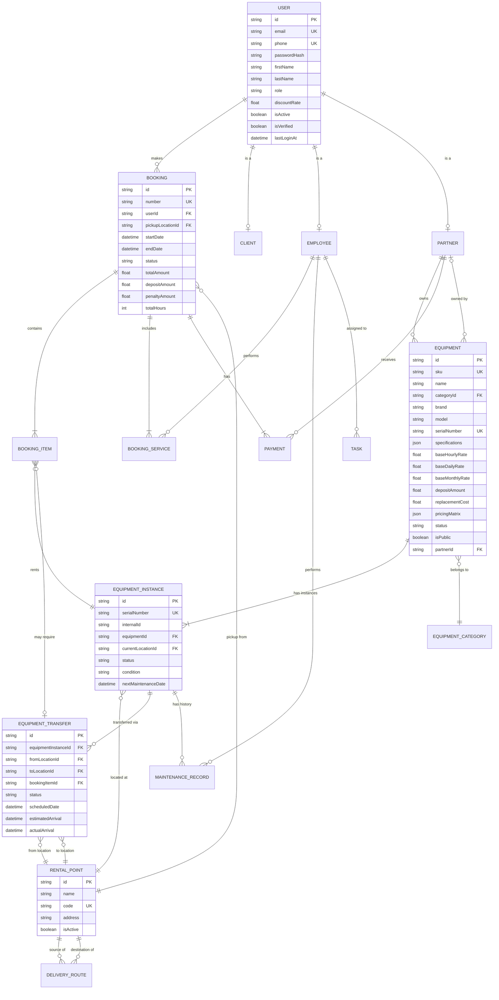

### Key Tables

**Core Tables (8)**
- `users` - Пользователи системы
- `clients` - Профили клиентов
- `employees` - Профили сотрудников
- `partners` - Профили партнёров
- `bookings` - Бронирования
- `booking_items` - Позиции в бронировании
- `equipment` - Оборудование (каталог)
- `equipment_instances` - Экземпляры оборудования

**Supporting Tables (12)**
- `equipment_categories` - Категории оборудования
- `rental_points` - Пункты выдачи
- `equipment_transfers` - Переброски оборудования
- `delivery_routes` - Маршруты доставки
- `booking_services` - Дополнительные услуги
- `payments` - Платежи
- `inventory` - Инвентаризация
- `maintenance_records` - Записи о ТО
- `tasks` - Задачи
- `reviews` - Отзывы
- `booking_changes` - История изменений
- `system_logs` - Системные логи

---

## 🔐 SECURITY CONSIDERATIONS

### Current Security Status

```yaml
✅ Implemented:
  - TypeScript strict mode
  - Input validation with Zod (domain layer)
  - Repository pattern (SQL injection protection)
  - Environment variables for secrets
  - CVE-2025-55182 fix (Next.js update to 15.5.9+)
  - Security headers (CSP, X-Frame-Options, etc.)
  - Rate limiting

⚠️ Partial:
  - Password hashing (planned with bcrypt)
  - Session management (NextAuth setup needed)

❌ Missing (CRITICAL):
  - CORS configuration
  - API authentication/authorization
  - Input sanitization on API routes
  - File upload validation
  - SQL injection prevention (need to verify Prisma usage)
  - JWT (Access and Refresh tokens)
```

### Security Checklist

```markdown
Priority 1 (This Week):
- [X] Update Next.js to 15.5.9
- [ ] Update React to 19.2.1+
- [X] Add security headers
- [ ] Configure CSP
- [X] Setup rate limiting
- [ ] Add CORS configuration

Priority 2 (Next Week):
- [ ] Implement NextAuth
- [ ] Add bcrypt password hashing
- [ ] Setup session management
- [ ] Add API authentication middleware
- [ ] Implement role-based access control

Priority 3 (Week 3):
- [ ] Add input sanitization
- [ ] Implement file upload validation
- [ ] Add XSS protection
- [ ] Setup WAF rules
- [ ] Add security monitoring
```

---

## 🎯 BUSINESS LOGIC SUMMARY

### Core Business Rules

**Booking Rules**
1. Minimum rental period: 3 hours
2. Deposit: 30% of total amount
3. Booking must be made at least 2 hours in advance
4. Equipment must be available for entire rental period
5. The user must be confirmed to participate in the cumulative discount system
6. An unconfirmed user leaves a deposit covering 100% of the estimated cost for the duration of the rental

**Cancellation Policy**
```typescript
function calculateCancellationPenalty(
  hoursUntilStart: number
): number {
  if (hoursUntilStart > 48) return 0
  if (hoursUntilStart > 24) return depositAmount * 0.5
  return depositAmount * 1.0
}
```

**Late Return Policy**
```typescript
function calculateLateReturnPenalty(
  hoursLate: number,
  bookingAmount: number
): number {
  if (hoursLate <= 0) return 0
  if (hoursLate <= 2) return bookingAmount * 0.1
  if (hoursLate <= 24) return bookingAmount * 0.25
  return bookingAmount + depositAmount
}
```

**Pricing Calculation**
```typescript
function calculateTotalAmount(params: {
  equipment: Equipment[]
  period: RentalPeriod
  discountRate: number
}): Money {
  const hours = period.getDurationInHours()
  
  // Determine pricing type
  let rate: 'hourly' | 'daily' | 'monthly'
  if (hours <= 8) rate = 'hourly'
  else if (hours <= 720) rate = 'daily'
  else rate = 'monthly'
  
  // Calculate base amount
  let totalAmount = equipment.reduce((sum, item) => {
    const baseRate = item[`base${capitalize(rate)}Rate`].amount
    const quantity = hours / (rate === 'hourly' ? 1 : rate === 'daily' ? 24 : 720)
    return sum + (baseRate * quantity)
  }, 0)
  
  // Apply discount
  if (params.discountRate > 0) {
    totalAmount = totalAmount * (1 - params.discountRate / 100)
  }
  
  return new Money(totalAmount)
}
```

**Transfer Logistics**
```typescript
// Predefined routes with transit times
const routes = {
  'EKB-UFA': 3, // days
  'EKB-SMR': 4,
  'EKB-TMN': 3,
  'UFA-SMR': 3,
  'UFA-TMN': 4,
  'SMR-TMN': 5,
}

function calculateTransferTimeline(
  from: RentalPoint,
  to: RentalPoint,
  bookingStart: Date
): TransferTimeline {
  const transitDays = routes[`${from.code}-${to.code}`]
  const bufferDays = 1
  
  const scheduledDeparture = new Date(bookingStart)
  scheduledDeparture.setDate(scheduledDeparture.getDate() - transitDays)
  
  const estimatedArrival = new Date(bookingStart)
  estimatedArrival.setDate(estimatedArrival.getDate() + transitDays + bufferDays)
  
  return {
    scheduledDeparture,
    estimatedArrival,
    transitDays,
    bufferDays,
  }
}
```

---

## 📦 PACKAGE STRUCTURE

### Monorepo Organization

```
crm-rentacamera/
├── apps/                           # Applications
│   ├── web/                       # Client-facing website (Next.js)
│   ├── admin/                     # Admin panel (Next.js)
│   └── mobile/                    # Mobile PWA (Next.js)
│
├── packages/                      # Shared packages
│   ├── core/                      # Domain + Application + Infrastructure
│   │   ├── domain/               # Pure business logic
│   │   ├── application/          # Use cases, commands, queries
│   │   └── infrastructure/       # Repositories, services, configs
│   │
│   ├── database/                 # Prisma schema & client
│   │   ├── prisma/
│   │   │   ├── schema.prisma
│   │   │   └── models/
│   │   └── src/
│   │
│   ├── ui/                       # Shared UI components
│   │   └── src/
│   │       └── components/
│   │
│   └── utils/                    # Utility functions
│
├── services/                      # Microservices (future)
│   ├── api-gateway/              # Fastify API Gateway
│   ├── auth-service/             # Authentication service
│   ├── booking-service/          # Booking microservice
│   ├── notification-service/     # Notification microservice
│   └── sync-service/             # CRDT sync service
│
├── docs/                         # Documentation
│   ├── architecture/
│   ├── api/
│   └── deployment/
│
└── scripts/                      # Build & deployment scripts
```

### Dependencies Between Packages

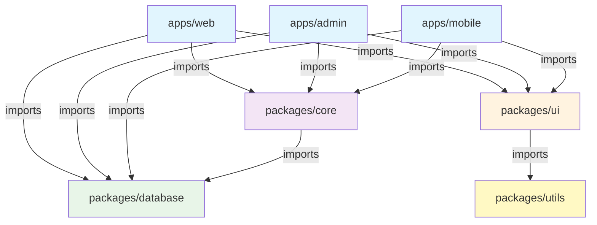
